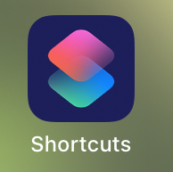

<button title="Make your project into an app (this requires the shortcuts app)" type="button" onclick="if(document.getElementById('turtorial') .style.display=='none') {document.getElementById('turtorial') .style.display=''}else{document.getElementById('turtorial') .style.display='none'}">Make your project into an "app"</button>

  
Invented by Awesome_e. Text by Dog Icing.
 

 
<ul> 
  <li>First, open the shortcuts app and create a new shortcut.</li>
   
<li>Next, open "Web", scroll down to safari.</li>
   
<li>Now, select either show webpage or open URLs.</li>
   
<li>Open Hopscotch and find the project you want in your home screen.</li>
   
<li>Then, press paste to paste the url of your project.</li>
   
<li>Press the three dots next to the title, fill in the names, select an icon and press "add".</li>
   
<li>And Done!</li>
</ul>

 

<button onclick="window.location.href='https://dogicing.github.io/hopnet/';">
      HopNet
    </button>

